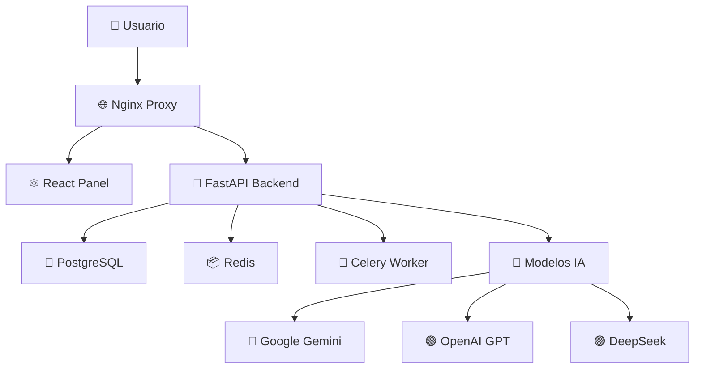

# 🤖 Bytchat SaaS - Plataforma de IA v4.0

> **Plataforma completa para crear, gestionar y monetizar asistentes de IA con múltiples modelos de última generación**

[](https://opensource.org/licenses/MIT)
[](https://www.python.org/downloads/)
[](https://fastapi.tiangolo.com)
[](https://reactjs.org)

## 📋 Tabla de Contenidos

- [🚀 Características Principales](#-características-principales)
- [💰 Planes y Precios](#-planes-y-precios)
- [🤖 Modelos de IA Disponibles](#-modelos-de-ia-disponibles)
- [🏗️ Arquitectura](#️-arquitectura)
- [🔐 Sistema de Roles](#-sistema-de-roles)
- [⚡ Instalación Rápida](#-instalación-rápida)
- [📊 Analytics y Métricas](#-analytics-y-métricas)
- [🔧 Configuración](#-configuración)
- [📚 Documentación](#-documentación)

---

## 🚀 Características Principales

### 🎯 **Para Desarrolladores**
- **API REST completa** con documentación interactiva (Swagger/OpenAPI)
- **Múltiples modelos de IA**: Google Gemini, OpenAI GPT, DeepSeek
- **Sistema de métricas avanzado** con tracking de tokens y costos
- **Autenticación JWT** con roles y permisos granulares
- **Procesamiento de documentos** con RAG (Retrieval-Augmented Generation)
- **Cola de tareas asíncronas** con Celery y Redis

### 🎨 **Para Usuarios Finales**
- **Panel de control moderno** construido con React
- **Widget de chat profesional** para integrar en cualquier web
- **Entrenamiento de bots** arrastrando y soltando documentos
- **Analytics en tiempo real** con gráficos interactivos
- **Gestión de usuarios** con sistema de aprobaciones
- **Cambio de contraseñas** seguro y encriptado

### 🔒 **Seguridad y Escalabilidad**
- **Contenedores Docker** para despliegue consistente
- **Base de datos PostgreSQL** con migraciones automáticas
- **Proxy inverso Nginx** con SSL/TLS
- **Encriptación de contraseñas** con bcrypt
- **Rate limiting** y protección contra abuso

---

## 💰 Planes y Precios

| Plan | Precio/mes | Tokens Incluidos | Tokens Adicionales | Ideal para |
|------|------------|------------------|-------------------|------------|
| **FREE** | $0 | 100K | $0.15/1K | Proyectos personales, pruebas |
| **PRO** | $20 | 500K | $0.12/1K | Empresas, sitios comerciales |
| **ENTERPRISE** | $100 | 2M | $0.10/1K | Alto volumen, aplicaciones enterprise |

### ✨ **Todos los planes incluyen:**
- ✅ Bots ilimitados
- ✅ Acceso a todos los modelos de IA
- ✅ Widget de chat personalizable
- ✅ Analytics detalladas
- ✅ API REST completa
- ✅ Entrenamiento con documentos

**[📋 Ver detalles completos de planes →](./PRICING.md)**

---

## 🤖 Modelos de IA Disponibles

### **Google Gemini Flash** 🚀
- **Ultra rápido** - Respuestas en millisegundos
- **Costo eficiente** - $0.000075 por 1K tokens
- **Ideal para**: Chat en tiempo real, consultas frecuentes

### **Google Gemini Pro** 🧠
- **Reasoning avanzado** - Análisis complejos
- **Calidad premium** - $0.00125 por 1K tokens
- **Ideal para**: Tareas que requieren análisis profundo

### **OpenAI GPT-4** 🏆
- **El más avanzado** - Líder del mercado
- **Calidad máxima** - $0.003 por 1K tokens
- **Ideal para**: Escritura creativa, tareas complejas

### **DeepSeek Chat** 💎
- **Mejor precio-calidad** - Rendimiento excepcional
- **Súper económico** - $0.00014 por 1K tokens
- **Ideal para**: Uso general, optimización de costos

---

## 🏗️ Arquitectura



### **Servicios incluidos:**
- **🌐 Nginx**: Proxy inverso con SSL/TLS
- **🚀 FastAPI**: API REST principal
- **⚛️ React**: Panel de control moderno
- **🐘 PostgreSQL**: Base de datos relacional
- **📦 Redis**: Cache y broker de mensajes
- **👷 Celery**: Procesamiento de tareas en background

---

## 🔐 Sistema de Roles

### **👤 USER** (Usuario Regular)
- ✅ Crear y gestionar bots personales
- ✅ Entrenar bots con documentos
- ✅ Acceso al chat integrado
- ✅ Ver analytics propias
- ✅ Cambiar contraseña

### **👨‍💼 ADMIN** (Administrador)
- ✅ **Todo lo del USER** +
- ✅ Panel de administración
- ✅ Aprobar/rechazar usuarios
- ✅ Ver métricas globales
- ✅ Gestionar usuarios

### **🔒 SUPER_ADMIN** (Super Administrador)
- ✅ **Todo lo del ADMIN** +
- ✅ Cambiar roles de usuarios
- ✅ Acceso completo al sistema
- ✅ Configuraciones avanzadas

---

## ⚡ Instalación Rápida

### **Prerrequisitos**
- Docker y Docker Compose
- Git
- Puerto 8001 disponible

### **1. Clonar repositorio**
```bash
git clone https://github.com/tu-usuario/bytchat-saas.git
cd bytchat-saas
```

### **2. Configurar variables de entorno**
```bash
cp .env.example .env
# Editar .env con tus API keys
```

### **3. Obtener API Keys** (Todas GRATIS)

#### **Google Gemini (Recomendado)**
1. Ir a [Google AI Studio](https://aistudio.google.com/app/apikey)
2. Crear nueva API key
3. Agregar a `.env`: `GOOGLE_API_KEY=tu_api_key`

#### **OpenAI (Opcional)**
1. Ir a [OpenAI Platform](https://platform.openai.com/api-keys)
2. Crear nueva API key
3. Agregar a `.env`: `OPENAI_API_KEY=tu_api_key`

#### **DeepSeek (Opcional)**
1. Ir a [DeepSeek Platform](https://platform.deepseek.com)
2. Crear nueva API key
3. Agregar a `.env`: `DEEPSEEK_API_KEY=tu_api_key`

### **4. Levantar servicios**
```bash
docker compose up -d
```

### **5. Acceder a la plataforma**
- **Panel de control**: http://localhost:8001
- **API Docs**: http://localhost:8001/docs
- **Demo Widget**: http://localhost:8001/static/demo-burbuja.html

### **6. Credenciales por defecto**
- **Email**: admin@bytcode.tech
- **Password**: superagente123

---

## 📊 Analytics y Métricas

### **Dashboard incluye:**
- 📈 **Uso por proveedor de IA** (Google, OpenAI, DeepSeek)
- 🔤 **Tokens consumidos y restantes**
- 💰 **Costos detallados por modelo**
- 📅 **Actividad diaria** (últimos 7 días)
- 🎯 **Distribución de tokens** por plan
- ⚡ **Métricas en tiempo real**

### **Características avanzadas:**
- ✅ Tracking automático de todos los chats
- ✅ Cálculo de costos por token
- ✅ Alertas de límites de plan
- ✅ Exportación de datos
- ✅ API para métricas customizadas

---

## 🔧 Configuración

### **Variables de entorno principales:**
```bash
# Base de datos
DB_USER=postgres
DB_PASSWORD=postgres
DB_NAME=bytchat

# API Keys de modelos IA
GOOGLE_API_KEY=tu_google_api_key
OPENAI_API_KEY=tu_openai_api_key
DEEPSEEK_API_KEY=tu_deepseek_api_key

# Super Admin
SUPER_ADMIN_EMAIL=admin@bytcode.tech
SUPER_ADMIN_PASSWORD=tu_password_seguro
```

### **Personalización:**
- **Logo y branding**: Editar `/static/` 
- **Colores**: Modificar CSS en `/bytchat-panel/`
- **Modelos**: Configurar en `/app/core/model_router.py`
- **Precios**: Ajustar en `/app/services/metrics_service.py`

---

## 📚 Documentación

### **Para Desarrolladores:**
- [📖 API Reference](http://localhost:8001/docs) - Documentación interactiva
- [🔧 Configuración Avanzada](./docs/configuration.md)
- [🚀 Despliegue en Producción](./docs/deployment.md)
- [🔌 Integraciones](./docs/integrations.md)

### **Para Usuarios:**
- [💰 Planes y Precios](./PRICING.md)
- [🎯 Guía de Usuario](./docs/user-guide.md)
- [🤖 Entrenamiento de Bots](./docs/bot-training.md)
- [📊 Analytics](./docs/analytics.md)

### **Widget de Chat:**
- [⚡ Integración Rápida](./docs/widget-integration.md)
- [🎨 Personalización](./docs/widget-customization.md)
- [📋 Ejemplos](./docs/widget-examples.md)

---

## 🚀 Stack Tecnológico

### **Backend:**
- **FastAPI** - Framework web moderno y rápido
- **PostgreSQL** - Base de datos relacional robusta  
- **Redis** - Cache y broker de mensajes
- **Celery** - Procesamiento asíncrono
- **SQLAlchemy** - ORM avanzado
- **Pydantic** - Validación de datos

### **Frontend:**
- **React 18** - Interfaz de usuario moderna
- **TypeScript** - Tipado estático
- **Tailwind CSS** - Estilos utility-first
- **Chart.js** - Gráficos interactivos
- **Axios** - Cliente HTTP

### **DevOps:**
- **Docker & Docker Compose** - Contenedores
- **Nginx** - Proxy inverso
- **SSL/TLS** - Certificados automáticos
- **GitHub Actions** - CI/CD (opcional)

---

## 🤝 Contribuir

1. Fork el proyecto
2. Crear rama feature (`git checkout -b feature/nueva-caracteristica`)
3. Commit cambios (`git commit -am 'Agregar nueva característica'`)
4. Push a la rama (`git push origin feature/nueva-caracteristica`)
5. Crear Pull Request

---

## 📞 Soporte

- **📧 Email**: support@bytcode.tech
- **💬 Discord**: [Comunidad Bytchat](https://discord.gg/bytchat)
- **📖 Docs**: [docs.bytchat.tech](https://docs.bytchat.tech)
- **🐛 Issues**: [GitHub Issues](https://github.com/tu-usuario/bytchat-saas/issues)

---

## 📄 Licencia

Este proyecto está bajo la Licencia MIT. Ver [LICENSE](LICENSE) para más detalles.

---

## ⭐ ¿Te gustó el proyecto?

**¡Dale una estrella en GitHub!** ⭐ y ayuda a otros desarrolladores a descubrir Bytchat.

**[🚀 Crear Cuenta Gratis](https://bytchat.tech)** | **[📋 Ver Planes](./PRICING.md)** | **[📖 Documentación](https://docs.bytchat.tech)**